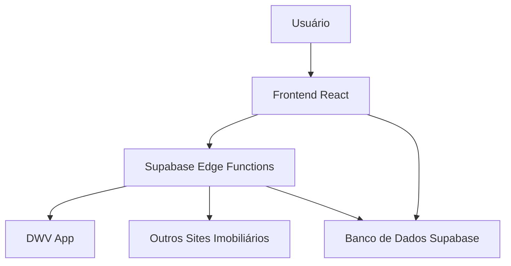
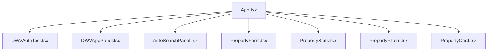
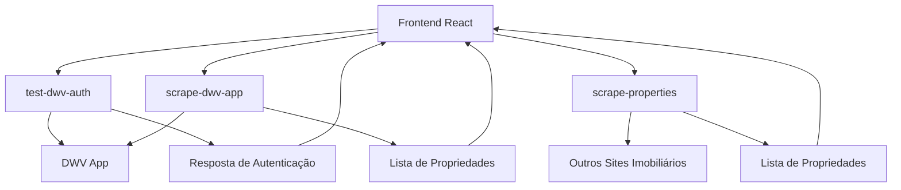
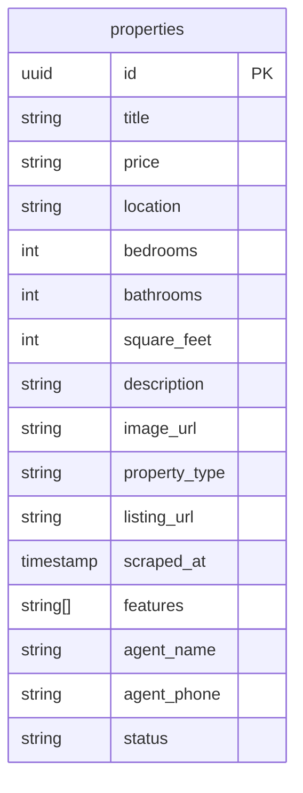
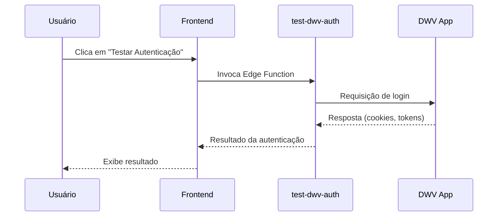
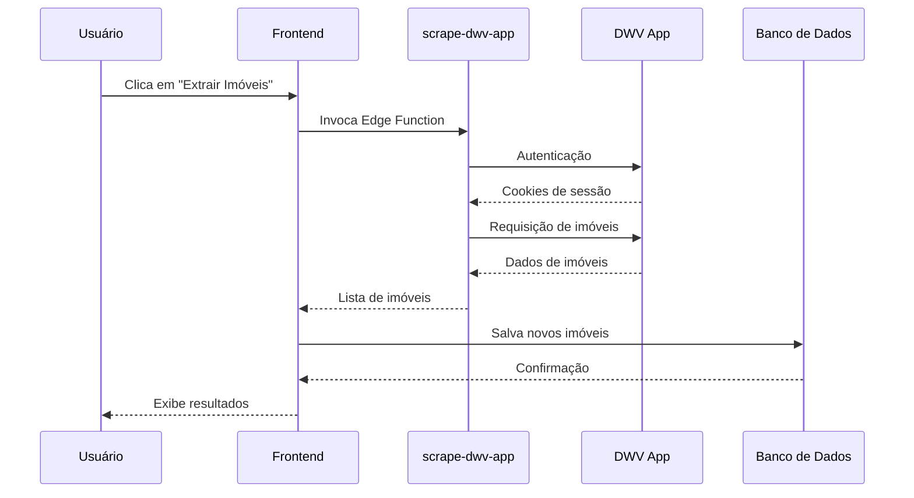
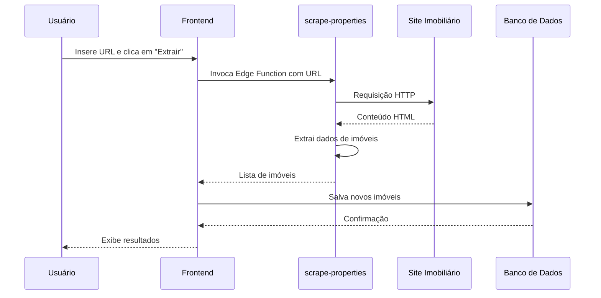

# Arquitetura do DWV Scraper

Este documento descreve a arquitetura do DWV Scraper, um aplicativo para extração e gerenciamento de dados de imóveis do DWV App e outros sites imobiliários.

## Visão Geral da Arquitetura

O DWV Scraper é construído com uma arquitetura moderna baseada em React para o frontend e Supabase para o backend e armazenamento de dados. O sistema utiliza Edge Functions do Supabase para executar operações de scraping em servidores próximos aos usuários.

## Componentes Principais

### 1. Frontend (React/TypeScript)

O frontend é construído com React e TypeScript, utilizando Vite como ferramenta de build. A interface é responsável por fornecer uma experiência amigável para o usuário interagir com as funcionalidades de scraping e visualizar os dados extraídos.

#### Estrutura de Componentes

#### Serviços

- **dwvAuthService.ts**: Gerencia a autenticação com o DWV App
- **dwvAppService.ts**: Gerencia a extração e armazenamento de dados do DWV App
- **propertySearchService.ts**: Gerencia a busca e extração de imóveis de outros sites
- **supabase.ts**: Configura e gerencia a conexão com o Supabase

### 2. Backend (Supabase Edge Functions)

O backend é implementado como Edge Functions do Supabase, permitindo a execução de código serverless próximo aos usuários. As funções são responsáveis por autenticar, extrair e processar os dados dos sites imobiliários.

#### Edge Functions

- **test-dwv-auth**: Testa a autenticação com o DWV App
- **scrape-dwv-app**: Extrai dados de imóveis do DWV App
- **scrape-properties**: Extrai dados de imóveis de URLs específicas

### 3. Banco de Dados (Supabase PostgreSQL)

O banco de dados PostgreSQL do Supabase é utilizado para armazenar os dados extraídos dos sites imobiliários. A estrutura principal é baseada na tabela `properties`.

#### Esquema do Banco de Dados

## Fluxo de Dados

### 1. Autenticação no DWV App

### 2. Extração de Dados do DWV App

### 3. Extração de Dados de Outros Sites

## Estratégias de Scraping

### 1. Autenticação

O sistema utiliza múltiplas estratégias para autenticar no DWV App:

1. **Form Login**: Submissão do formulário de login tradicional
2. **API Login**: Tentativa de login via endpoints de API
3. **Token Management**: Gerenciamento de cookies e tokens de sessão

### 2. Extração de Dados

O sistema utiliza várias técnicas para extrair dados:

1. **API First**: Tenta primeiro extrair dados via APIs
2. **HTML Parsing**: Extrai dados do HTML quando APIs não estão disponíveis
3. **JSON Extraction**: Extrai dados de objetos JSON embutidos nas páginas
4. **Fallback Strategy**: Utiliza estratégias alternativas quando a principal falha

## Considerações de Segurança

1. **Armazenamento de Credenciais**: As credenciais são armazenadas de forma segura no código da Edge Function
2. **Cookies e Sessões**: Os cookies e tokens de sessão são utilizados apenas durante o processo de scraping
3. **Rate Limiting**: Implementação de delays entre requisições para evitar bloqueios
4. **User Agent Spoofing**: Utilização de User Agents realistas para evitar detecção

## Escalabilidade e Performance

1. **Edge Functions**: Execução próxima aos usuários para reduzir latência
2. **Deduplicação**: Verificação de imóveis existentes antes de salvar novos
3. **Paginação**: Implementação de paginação para lidar com grandes volumes de dados
4. **Caching**: Possibilidade de implementar caching para reduzir requisições

## Limitações Atuais

1. **Dependência de Estrutura**: O scraper depende da estrutura atual do DWV App
2. **Detecção de Anti-Bot**: Não há tratamento avançado para medidas anti-bot
3. **Concorrência**: Não há implementação de scraping concorrente

## Melhorias Futuras

1. **Proxy Rotation**: Implementação de rotação de proxies para evitar bloqueios
2. **Headless Browser**: Utilização de navegadores headless para sites mais complexos
3. **Machine Learning**: Implementação de ML para extração de dados mais precisa
4. **Monitoramento**: Sistema de monitoramento e alertas para falhas no scraping
